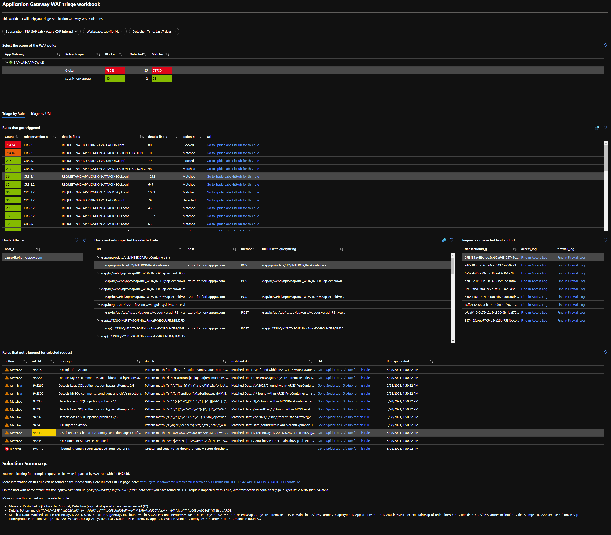

# Workbook for Application Gateway WAF Triage

This repo provides a sample workbook for Log Analytics which is designed to help triaging the violation of WAF rules for Application Gateway.  

Often companies struggle to parse the logs from the Application Gateway Web Application Firewall and triage them to determine which ones are true violations and which ones are false positives.  Especially during the design phase of an application, it is important to review these logs and make sure to adapt the application and/or WAF configuration so to eliminate false positives.  This is where this workbook might help.

